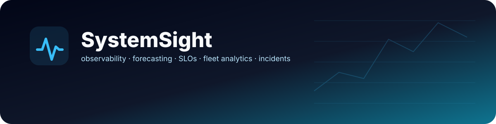
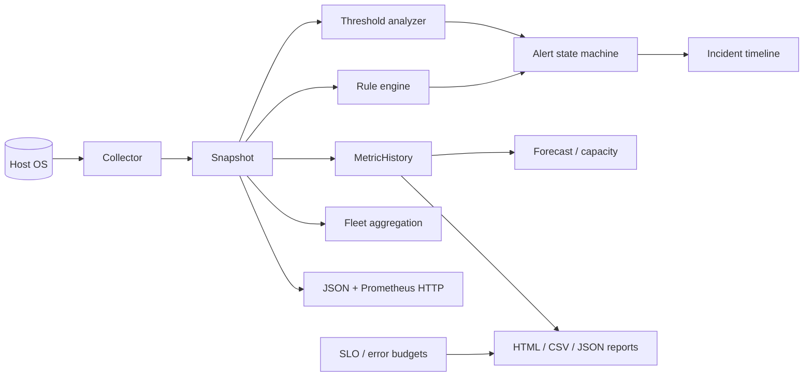

<div align="center">
  

  [](https://github.com/shiv814/systemsight-monitor/actions/workflows/test.yml)
  
  
  

  **A cross-platform host observability toolkit with collection, analysis, history, anomaly detection, alert lifecycles, rules, forecasting, SLO/error-budget math, fleet summaries, incident timelines, reports, and Prometheus-compatible output.**
</div>

---

## What SystemSight demonstrates

SystemSight started as a host-health CLI. Version 3 pushes it toward a small observability platform while keeping the implementation readable enough to discuss line-by-line in an interview.

It collects real machine state with `psutil`, retains metric history, evaluates thresholds and custom rules, manages alert lifecycle state, exposes JSON and Prometheus-compatible HTTP endpoints, estimates short-term trends/capacity pressure, computes SLO error budgets, aggregates multiple hosts, reconstructs incident timelines, and generates a self-contained dark-mode HTML report.

## v3 capability map

| Layer | Capabilities |
|---|---|
| Collection | CPU/per-core, load, memory, swap, disks, disk I/O, network, temperatures, uptime, platform and top processes |
| Analysis | warning/critical thresholds, health score and remediation recommendations |
| History | bounded time-series storage, statistics, JSON/CSV export and z-score anomaly detection |
| Alert lifecycle | open, escalate, remind and recover events with cooldown behaviour |
| Rule engine | nested metric paths, six comparison operators, severities and batch filtering |
| Forecasting | linear trend, EWMA, flat-baseline anomaly handling and threshold/capacity projection |
| SLOs | error budgets, compliance, burn rate and multi-window burn comparison |
| Fleet view | min/max/average/spread across hosts and hottest-host identification |
| Incidents | grouped alert timelines, peak severity, recovery time and duration |
| Interfaces | snapshot/watch/report CLI modes, JSON API and Prometheus-compatible metrics endpoint |
| Presentation | self-contained HTML report with inline SVG sparklines |

## Architecture



## Quick start

```bash
git clone https://github.com/shiv814/systemsight-monitor.git
cd systemsight-monitor
python -m pip install -e .
systemsight snapshot
systemsight watch --interval 2
```

Start the HTTP surface with `systemsight serve --host 127.0.0.1 --port 9108`.

## v3 offline demo

```bash
systemsight-demo
```

The demo exercises rule evaluation, trend forecasting, capacity projection, fleet aggregation and SLO error-budget math, then writes `systemsight-demo.html`.

## Custom rules

```python
from systemsight.rules import MetricRule, Operator, RuleSet
rules = RuleSet([MetricRule("cpu-hot", "cpu.percent", Operator.GTE, 85, "warning")])
for result in rules.triggered(snapshot): print(result.severity, result.message)
```

## Forecasting / capacity

```python
from systemsight.forecast import linear_forecast, project_threshold
history = [48, 52, 55, 59, 64, 68]
print(linear_forecast(history, horizon=3))
print(project_threshold(history, threshold=90))
```

The forecast layer uses intentionally inspectable ordinary least squares and EWMA rather than pretending a small local history is a production forecasting model.

## SLO / error budgets

```python
from systemsight.slo import SLO, evaluate_error_budget
budget = evaluate_error_budget(SLO("availability", .999, 30*24*60), total_events=100_000, bad_events=35)
```

This separates service reliability from machine utilization: a busy machine can meet an SLO, and an idle machine can still serve a failing service.

## Repository map

```text
systemsight/
  collector.py   OS metric collection
  analyzer.py    thresholds / health scoring
  history.py     bounded time-series + anomalies
  alerts.py      stateful alert lifecycle
  agent.py       orchestration
  server.py      HTTP + Prometheus output
  cli.py         command line
  rules.py       composable metric rules
  forecast.py    trends / EWMA / capacity
  slo.py         error-budget calculations
  fleet.py       multi-host aggregation
  incident.py    incident reconstruction
  report.py      standalone HTML + sparklines
  demo.py        v3 demonstration
```

## Verification

`python -m compileall systemsight`, `python -m pytest -q`, and `python -m systemsight.demo` are all run locally; CI validates Python 3.10/3.12 across Linux, Windows and macOS and now runs the demo too.

## Documentation

- [Architecture](docs/ARCHITECTURE.md)
- [Engineering notes](docs/ENGINEERING.md)
- [Security scope](docs/SECURITY.md)
- [Contributing](CONTRIBUTING.md)

## Scope

SystemSight is an engineering portfolio/local observability project, not a replacement for a hardened enterprise monitoring stack. Production use would need authentication, TLS, centralized persistence, retention policy, secure remote transport and stronger operational controls.

## License
MIT © Shivam Patel
