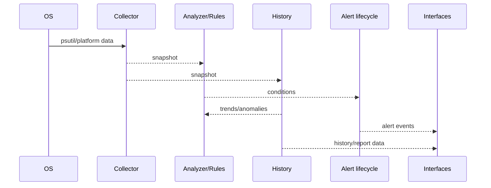

# SystemSight Architecture

SystemSight deliberately separates measurement from policy and state. `collector.py` asks the OS for measurements; `analyzer.py` and `rules.py` apply policy; `history.py` retains numeric history; `forecast.py` derives trend/capacity signals; `alerts.py` owns lifecycle state; `incident.py` reconstructs incident summaries; `slo.py` models reliability objectives independently of host metrics; `fleet.py` aggregates hosts; and CLI/server are interfaces rather than sources of domain truth.

Missing platform metrics are represented as unavailable rather than fabricated. Fleet aggregation is transport-agnostic so a future central collector can submit snapshots without rewriting analytics.
